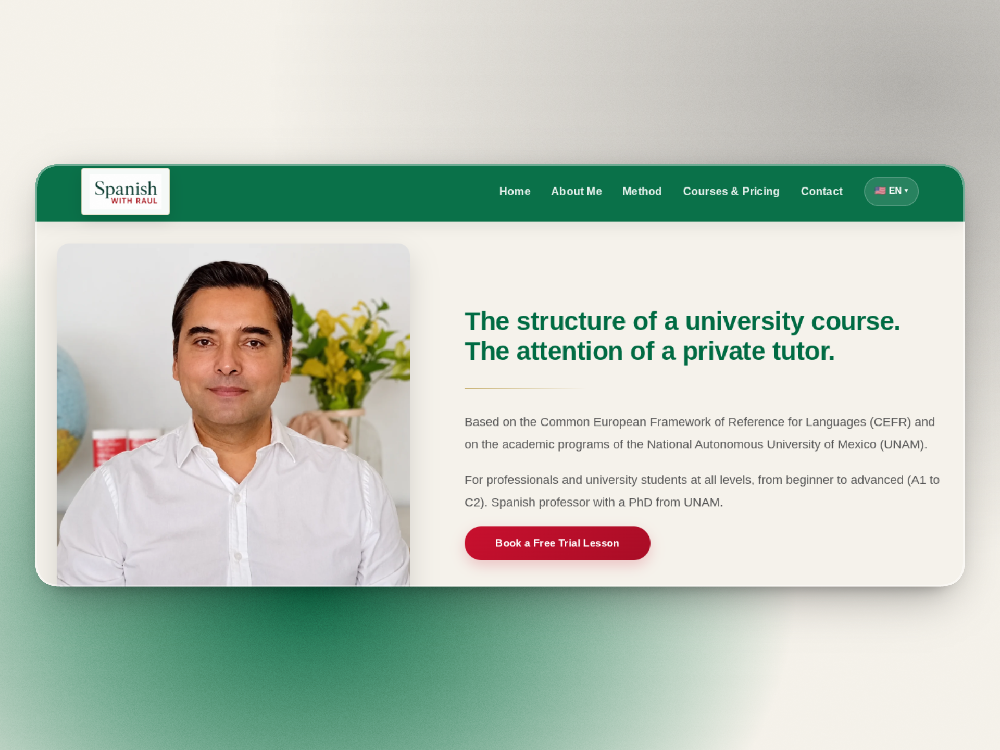
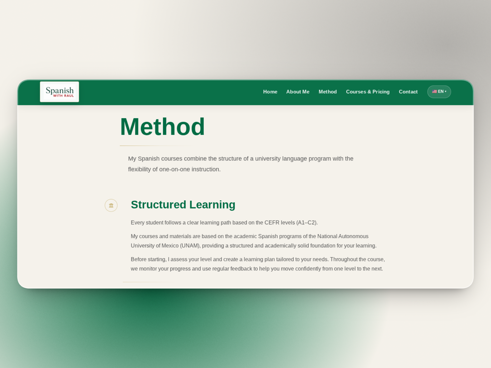
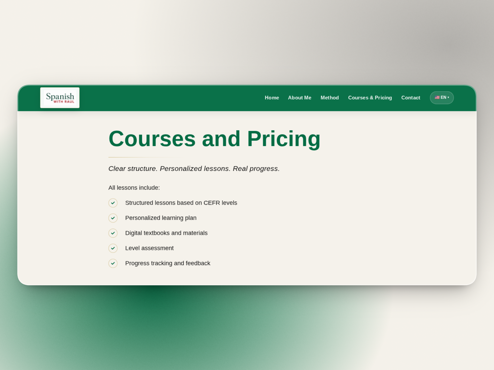
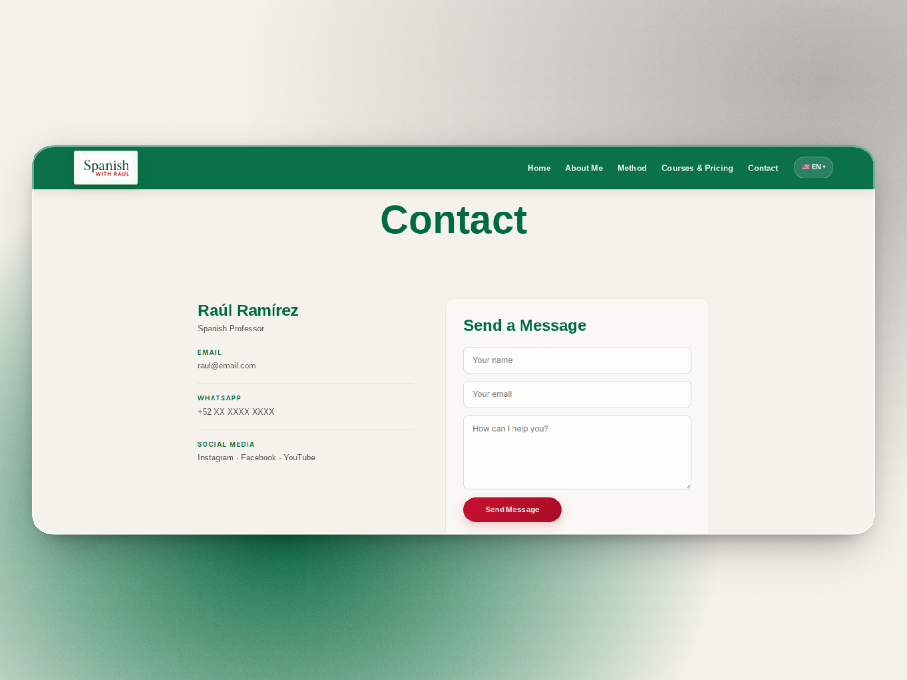

# Spanish With Raul

A multilingual website for a university-level Spanish professor, designed to present his teaching methodology, courses, credentials, and contact information in a professional and accessible way.

The project was developed as a modern alternative to an existing Wix website, focusing on performance, responsive design, SEO, and multilingual support.

## Live Demo

https://spanishwithraul.com

## Overview

Spanish With Raul is a professional website for Raúl Ramírez, a Spanish professor from Mexico City with a PhD in Hispanic Language and Literature from the National Autonomous University of Mexico (UNAM).

The website provides information about:

- Teaching methodology
- Courses and pricing
- Academic background
- Student testimonials
- Contact and trial lesson booking

The site is available in:

- English
- Spanish
- Portuguese (Brazil)

## Features

- Fully responsive design
- Multilingual routing (EN / ES / PT-BR)
- SEO-optimized pages
- Open Graph integration
- Google Analytics integration
- Google Search Console integration
- Contact form with EmailJS
- WhatsApp contact option
- Modern React architecture
- Custom domain deployment

## Tech Stack

### Frontend

- React
- React Router
- Vite
- CSS3

### Services

- EmailJS
- Google Analytics
- Google Tag Manager
- Google Search Console

### Hosting

- Render

## Project Structure

```bash
src
│
├── en
│   ├── components
│   └── pages
│
├── es
│   ├── components
│   └── pages
│
├── pt
│   ├── components
│   └── pages
│
├── assets
│
├── routes
│
└── App.jsx
```

## SEO Implementation

The website includes:

- Page-specific meta titles
- Page-specific meta descriptions
- Canonical URLs
- Open Graph tags
- XML Sitemap
- Robots.txt
- Structured data (Schema.org)
- Hreflang implementation for multilingual content

Supported language versions:

```text
English     → /
Spanish     → /es
Portuguese  → /pt
```

## Contact Form

The contact form is powered by EmailJS and sends messages directly to the site owner without requiring a backend server.

Information collected:

- Name
- Email
- Message

## Design Goals

The website was designed to communicate:

- Academic credibility
- Professionalism
- Personal attention
- Clear learning structure

The visual identity combines:

- Deep green tones inspired by education and trust
- Warm gold accents
- Clean typography
- Minimalist layouts
- Responsive user experience

## Future Improvements

- Advanced analytics events
- WhatsApp conversion tracking
- Additional structured data
- Blog section
- Online booking integration

## Highlights

- Multilingual website (English, Spanish, Portuguese)
- Responsive design
- SEO optimization (Schema, Sitemap, Open Graph, Hreflang)
- EmailJS contact form
- Google Analytics & Google Tag Manager integration
- Custom domain deployment

## Screenshots

### Home Page

Modern landing page introducing the teaching methodology, academic background, and free trial lesson.



---

### Teaching Method

Structured learning approach based on CEFR levels and university-level Spanish programs.



---

### Courses & Pricing

Clear course information, pricing structure, and learning benefits.



---

### Contact & Trial Lesson

Direct communication through a contact form and free trial lesson booking.



## Author

Developed by Suellen Silva

GitHub:
https://github.com/srasilva1910

LinkedIn:
https://www.linkedin.com/in/suellensilva
